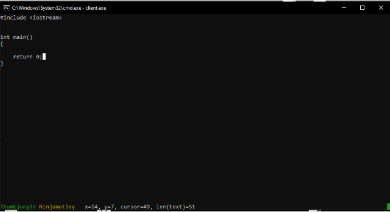
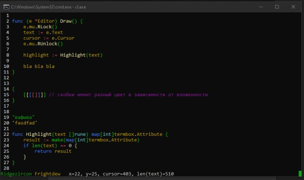

# Desktop приложение для совместного редактирования файлов

| Студент   | Медведев Кирилл Викторович   |
|:-----------:|:-----------:|
| Группа    | М8О-406Б-21    |

# Актуальность

# Цель и задачи
**Цель** — разработка автономного приложения для совместного редактирования файлов, подходящего для кратковременных рабочих сессий в условиях ограниченного доступа к Интернету и стороннему программному обеспечению.

**Задачи:**
- Спроектировать архитектуру приложения совместного редактора
- Разработать модуль совмещения изменений
- Разработать интерфейс редактора с минимальной зависимостью от окружения исполнения
- Произвести сравнительный анализ разработанного приложения с существующими решениями


# Описание ВКРБ
## Текстовый режим редактирования


## Режим редактирования кода


# Запуск совместного редактора

## 1. **Предварительные условия:**

- Установлен Go версии 1.20+ (https://go.dev/dl/).
- Рабочий сетевой стек.
- Терминал с поддержкой ANSI-цветов (Linux/macOS) или Windows Terminal (Windows).

## 2. **Установка зависимостей и запуск сервера**
```bash
cd path/to/root
go mod tidy
go run main.go
```
или
```bash
go build -o server main.go
./server
```

## 3. **Сборка и запуск клиента**
```bash
cd client
go mod tidy
go run main.go -server ws://localhost:8080 -login <editor_name>
```
или
```bash
go build -o client main.go
./client -server ws://localhost:8080 -login <editor_name>
```
